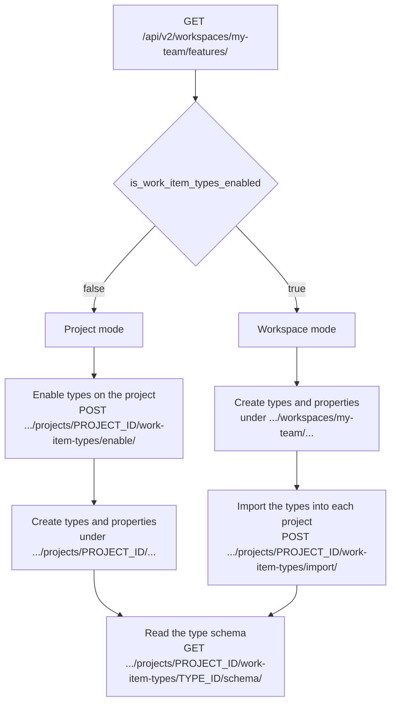

# Work item type modes

A workspace manages work item types in **exactly one mode**, and that choice decides which endpoints you write to.

| Mode               | Types are owned by | You write to                                                                    |
| ------------------ | ------------------ | ------------------------------------------------------------------------------- |
| **Project mode**   | Each project       | `/api/v2/workspaces/{slug}/projects/{project_id}/work-item-types/` and siblings |
| **Workspace mode** | The workspace      | `/api/v2/workspaces/{slug}/work-item-types/` and siblings                       |

Both surfaces exist in the API at all times. Only one of them accepts writes for a given workspace. This is the single most confusing thing about v2, and it is worth ten minutes now rather than an afternoon of debugging later.

## The rule that catches everyone

Writing to the wrong mode's endpoint returns **`409`** — not `404`, not `403`.

That status is deliberate. `404` would mean "no such thing" and `403` would mean "you may not do that", and neither is true. The capability exists and you are allowed to use it; it just lives on the other surface. `409` says the request conflicts with the workspace's current configuration, and the stable error `code` tells you which way to go.

| Situation                                                           | Status | `code`                                 |
| ------------------------------------------------------------------- | ------ | -------------------------------------- |
| You wrote to a **project** endpoint, workspace is in workspace mode | `409`  | `work_item_types_managed_at_workspace` |
| You wrote to a **workspace** endpoint, workspace is in project mode | `409`  | `work_item_types_managed_at_project`   |

<ResponsePanel status="409">

```json
{
  "type": "conflict",
  "code": "work_item_types_managed_at_workspace",
  "detail": "Work item types are managed at the workspace level for this workspace."
}
```

</ResponsePanel>

Read the code as an instruction, not just a complaint: `work_item_types_managed_at_workspace` means _"retry this against the workspace surface"_, and `work_item_types_managed_at_project` means _"retry this against the project surface"_.

::: tip Reads are not affected by mode
Only writes are gated. A `GET` works on both surfaces in both modes — and importantly, a project still surfaces its imported types while the workspace is in workspace mode. If you only ever read types, you can ignore this page entirely and list them from the project surface.
:::

## Discovering the current mode

Ask the workspace features endpoint. The `is_work_item_types_enabled` field is the mode discriminator.

```bash
curl "https://api.plane.so/api/v2/workspaces/my-team/features/" \
  -H "X-Api-Key: $PLANE_API_KEY"
```

<ResponsePanel status="200">

```json
{
  "id": "a72f1c40-5b8e-4d19-9f2a-3c6d8e1b7a55",
  "is_work_item_types_enabled": true,
  "is_workitem_hierarchy_enabled": false,
  "is_project_grouping_enabled": false,
  "is_teams_enabled": true,
  "is_wiki_enabled": true,
  "is_initiative_enabled": false,
  "is_customer_enabled": false,
  "is_release_enabled": false,
  "is_state_duration_enabled": false,
  "is_pi_enabled": false,
  "work_item_type_default_level": 0,
  "created_at": "2026-01-14T09:22:41.478363Z"
}
```

</ResponsePanel>

- `is_work_item_types_enabled: true` → **workspace mode**. Types are owned by the workspace.
- `is_work_item_types_enabled: false` → **project mode**. Types are owned by each project.

The toggle only puts the workspace into workspace mode when workspace-level work item types are also available on the workspace's plan. Where they are not, the workspace stays in project mode no matter how the toggle is set — so treat a successful write, not the toggle alone, as proof of which surface is live.

Switching the mode is a `PATCH` to the same endpoint (`workspaces.features:write` scope required). Treat it as an administrative action, not something an integration flips at runtime — it changes which surface every other client in the workspace must write to.

```bash
curl -X PATCH "https://api.plane.so/api/v2/workspaces/my-team/features/" \
  -H "X-Api-Key: $PLANE_API_KEY" \
  -H "Content-Type: application/json" \
  -d '{"is_work_item_types_enabled": true}'
```

See [Workspace features](/api-reference/v2/workspace-features/overview) for every field on this object.

## Which surface do I use?



Note where the two paths converge: **reading a type's schema always happens on the project surface**, in both modes, because a schema describes what you can write on a work item _in a project_.

## Project mode lifecycle

In project mode each project owns its own types. Two projects can have entirely unrelated type sets.

### 1. Enable types on the project

A project starts without work item types. Enabling creates the project's default `Task` type and returns it.

```bash
curl -X POST "https://api.plane.so/api/v2/workspaces/my-team/projects/4af68566-94a4-4eb3-94aa-50dc9427067b/work-item-types/enable/" \
  -H "X-Api-Key: $PLANE_API_KEY"
```

<ResponsePanel status="200">

```json
{
  "id": "2d9b6f31-4a70-4c88-9d15-8b0e3f27c6a4",
  "name": "Task",
  "description": "Default work item type with the option to add new properties",
  "is_active": true,
  "is_default": true,
  "is_epic": false,
  "level": 0,
  "logo_props": {
    "in_use": "icon",
    "icon": { "name": "Briefcase", "background_color": "#6d7b8a" }
  },
  "created_at": "2026-01-14T09:22:41.478363Z"
}
```

</ResponsePanel>

Send this once per project. Calling it again returns the existing default type rather than creating a second one.

### 2. Create a type

```bash
curl -X POST "https://api.plane.so/api/v2/workspaces/my-team/projects/4af68566-94a4-4eb3-94aa-50dc9427067b/work-item-types/" \
  -H "X-Api-Key: $PLANE_API_KEY" \
  -H "Content-Type: application/json" \
  -d '{
  "name": "Bug",
  "description": "Something is broken in production",
  "is_active": true
}'
```

### 3. Create a property

Properties are created against the project, independent of any type. A property needs a `display_name` and a `property_type`.

```bash
curl -X POST "https://api.plane.so/api/v2/workspaces/my-team/projects/4af68566-94a4-4eb3-94aa-50dc9427067b/work-item-properties/" \
  -H "X-Api-Key: $PLANE_API_KEY" \
  -H "Content-Type: application/json" \
  -d '{
  "display_name": "Severity",
  "property_type": "OPTION",
  "is_required": true,
  "is_multi": false
}'
```

For an `OPTION` property, add its choices under the property:

```bash
curl -X POST "https://api.plane.so/api/v2/workspaces/my-team/projects/4af68566-94a4-4eb3-94aa-50dc9427067b/work-item-properties/9e51a08b-3d47-4f62-bc19-2a7d5e0f8c31/options/" \
  -H "X-Api-Key: $PLANE_API_KEY" \
  -H "Content-Type: application/json" \
  -d '{ "name": "Sev 1", "is_default": false }'
```

### 4. Attach the property to a type

Creating a property does not put it on anything. Attach it to the types that should carry it — one property can serve several types.

```bash
curl -X POST "https://api.plane.so/api/v2/workspaces/my-team/projects/4af68566-94a4-4eb3-94aa-50dc9427067b/work-item-types/2d9b6f31-4a70-4c88-9d15-8b0e3f27c6a4/properties/" \
  -H "X-Api-Key: $PLANE_API_KEY" \
  -H "Content-Type: application/json" \
  -d '{ "properties": ["9e51a08b-3d47-4f62-bc19-2a7d5e0f8c31"] }'
```

Detaching is a `DELETE` on the same collection with the property id in the path. Detaching removes the property from the type; it does not delete the property.

### 5. Read the type's schema

The schema endpoint is the one call that tells you everything writable on a work item of this type — standard fields with their option lists, plus the type's custom properties.

```bash
curl "https://api.plane.so/api/v2/workspaces/my-team/projects/4af68566-94a4-4eb3-94aa-50dc9427067b/work-item-types/2d9b6f31-4a70-4c88-9d15-8b0e3f27c6a4/schema/" \
  -H "X-Api-Key: $PLANE_API_KEY"
```

<ResponsePanel status="200">

```json
{
  "type_id": "2d9b6f31-4a70-4c88-9d15-8b0e3f27c6a4",
  "type_name": "Bug",
  "type_description": "Something is broken in production",
  "type_logo_props": { "in_use": "icon", "icon": { "name": "Bug", "background_color": "#c2410c" } },
  "fields": {
    "name": { "type": "string", "required": true, "max_length": 255 },
    "priority": {
      "type": "option",
      "required": false,
      "default": "none",
      "options": [
        { "value": "urgent", "label": "Urgent" },
        { "value": "high", "label": "High" },
        { "value": "medium", "label": "Medium" },
        { "value": "low", "label": "Low" },
        { "value": "none", "label": "None" }
      ]
    },
    "state_id": {
      "type": "uuid",
      "required": false,
      "options": [
        {
          "id": "f960d3c2-8524-4a41-b8eb-055ce4be2a7f",
          "name": "In Progress",
          "color": "#3f76ff",
          "group": "started"
        }
      ]
    },
    "assignee_ids": { "type": "uuid", "is_multi": true, "required": false },
    "start_date": { "type": "date", "required": false, "format": "YYYY-MM-DD" }
  },
  "custom_fields": {
    "severity": {
      "id": "9e51a08b-3d47-4f62-bc19-2a7d5e0f8c31",
      "type": "OPTION",
      "name": "severity",
      "display_name": "Severity",
      "description": "",
      "required": true,
      "is_multi": false,
      "options": [
        { "id": "5c3e7d81-91b4-4a2e-8f60-1d4b9c6a2e77", "name": "Sev 1", "logo_props": null }
      ]
    }
  }
}
```

</ResponsePanel>

Add `?include=members,labels` to inline the assignee and label option lists. They can be large, so they are left out unless you ask.

## Workspace mode lifecycle

In workspace mode one set of types is defined once and shared. Projects opt into the types they want by importing them.

### 1. Create a type on the workspace

```bash
curl -X POST "https://api.plane.so/api/v2/workspaces/my-team/work-item-types/" \
  -H "X-Api-Key: $PLANE_API_KEY" \
  -H "Content-Type: application/json" \
  -d '{
  "name": "Bug",
  "description": "Something is broken in production",
  "is_active": true
}'
```

<ResponsePanel status="201">

```json
{
  "id": "2d9b6f31-4a70-4c88-9d15-8b0e3f27c6a4",
  "name": "Bug",
  "description": "Something is broken in production",
  "is_active": true,
  "is_default": false,
  "is_epic": false,
  "level": 0,
  "logo_props": { "in_use": "icon", "icon": { "name": "Bug", "background_color": "#c2410c" } },
  "created_at": "2026-01-14T09:22:41.478363Z"
}
```

</ResponsePanel>

### 2. Create workspace properties and attach them

Same two steps as project mode, one path segment shorter — there is no `project_id`.

```bash
# create the property
curl -X POST "https://api.plane.so/api/v2/workspaces/my-team/work-item-properties/" \
  -H "X-Api-Key: $PLANE_API_KEY" \
  -H "Content-Type: application/json" \
  -d '{ "display_name": "Severity", "property_type": "OPTION", "is_required": true }'

# add its options
curl -X POST "https://api.plane.so/api/v2/workspaces/my-team/work-item-properties/9e51a08b-3d47-4f62-bc19-2a7d5e0f8c31/options/" \
  -H "X-Api-Key: $PLANE_API_KEY" \
  -H "Content-Type: application/json" \
  -d '{ "name": "Sev 1" }'

# attach it to a type
curl -X POST "https://api.plane.so/api/v2/workspaces/my-team/work-item-types/2d9b6f31-4a70-4c88-9d15-8b0e3f27c6a4/properties/" \
  -H "X-Api-Key: $PLANE_API_KEY" \
  -H "Content-Type: application/json" \
  -d '{ "properties": ["9e51a08b-3d47-4f62-bc19-2a7d5e0f8c31"] }'
```

### 3. Narrow a property with contexts (workspace mode only)

A workspace property applies everywhere by default. A **property context** narrows where it applies and can override `is_required` / `is_multi` / `default_value` for that slice — for example, "Severity is required, but only on the Bug type in these three projects."

```bash
curl -X POST "https://api.plane.so/api/v2/workspaces/my-team/work-item-properties/9e51a08b-3d47-4f62-bc19-2a7d5e0f8c31/contexts/" \
  -H "X-Api-Key: $PLANE_API_KEY" \
  -H "Content-Type: application/json" \
  -d '{
  "applies_to_all_projects": false,
  "applies_to_all_work_item_types": false,
  "project_ids": ["4af68566-94a4-4eb3-94aa-50dc9427067b"],
  "issue_type_ids": ["2d9b6f31-4a70-4c88-9d15-8b0e3f27c6a4"],
  "is_required": true
}'
```

Contexts exist only on the workspace surface — there is no project-mode equivalent, because a project-owned property is already scoped to its project. See [Property contexts](/api-reference/v2/work-item-property-contexts/overview).

### 4. Import workspace types into a project

A workspace type is not usable in a project until the project imports it. This is what makes a shared type show up on that project's work items.

::: warning The import endpoint lives on the project path but requires workspace mode
`POST .../projects/{project_id}/work-item-types/import/` sits under a project URL, yet it is a **workspace-mode** operation — importing only makes sense when the workspace owns the types. Calling it in project mode returns `409 work_item_types_managed_at_project`. It is the one endpoint where the path segment and the required mode do not line up, so it surprises people.
:::

```bash
curl -X POST "https://api.plane.so/api/v2/workspaces/my-team/projects/4af68566-94a4-4eb3-94aa-50dc9427067b/work-item-types/import/" \
  -H "X-Api-Key: $PLANE_API_KEY" \
  -H "Content-Type: application/json" \
  -d '{ "work_item_types": ["2d9b6f31-4a70-4c88-9d15-8b0e3f27c6a4"] }'
```

Importing is idempotent — re-importing a type the project already has changes nothing.

### 5. Read the schema from the project

Once imported, the type behaves like any other type in that project. Read its schema from the **project** surface, exactly as in project mode:

```bash
curl "https://api.plane.so/api/v2/workspaces/my-team/projects/4af68566-94a4-4eb3-94aa-50dc9427067b/work-item-types/2d9b6f31-4a70-4c88-9d15-8b0e3f27c6a4/schema/" \
  -H "X-Api-Key: $PLANE_API_KEY"
```

This is the practical payoff of "reads are unaffected by mode": the code that reads a type and writes a work item against it is identical in both modes. Only the code that _defines_ types has to care.

## Endpoints by mode

| Operation                             | Project mode                                                            | Workspace mode                                                       |
| ------------------------------------- | ----------------------------------------------------------------------- | -------------------------------------------------------------------- |
| Enable types                          | `POST .../projects/{project_id}/work-item-types/enable/`                | Not applicable — `PATCH .../features/`                               |
| List / create types                   | `.../projects/{project_id}/work-item-types/`                            | `.../workspaces/{slug}/work-item-types/`                             |
| Get / update / delete a type          | `.../projects/{project_id}/work-item-types/{pk}/`                       | `.../workspaces/{slug}/work-item-types/{pk}/`                        |
| Mark a type as default                | `.../projects/{project_id}/work-item-types/{pk}/mark-default/`          | `.../workspaces/{slug}/work-item-types/{pk}/mark-default/`           |
| List / create properties              | `.../projects/{project_id}/work-item-properties/`                       | `.../workspaces/{slug}/work-item-properties/`                        |
| Property options                      | `.../projects/{project_id}/work-item-properties/{property_id}/options/` | `.../workspaces/{slug}/work-item-properties/{property_id}/options/`  |
| Attach / detach a property to a type  | `.../projects/{project_id}/work-item-types/{type_id}/properties/`       | `.../workspaces/{slug}/work-item-types/{type_id}/properties/`        |
| Property contexts                     | Not available                                                           | `.../workspaces/{slug}/work-item-properties/{property_id}/contexts/` |
| Import workspace types into a project | Not available                                                           | `POST .../projects/{project_id}/work-item-types/import/`             |
| Read a type's schema                  | `GET .../projects/{project_id}/work-item-types/{pk}/schema/`            | Same — read from the project surface                                 |

## Writing mode-agnostic code

If your integration has to work against workspaces you do not control, resolve the mode once at startup and pick a base path from it:

```python
import requests

BASE = "https://api.plane.so/api/v2"
HEADERS = {"X-Api-Key": "your-api-key"}


def type_base_path(slug, project_id):
    """Return the URL prefix that accepts work-item-type WRITES for this workspace."""
    features = requests.get(f"{BASE}/workspaces/{slug}/features/", headers=HEADERS)
    features.raise_for_status()

    if features.json()["is_work_item_types_enabled"]:
        return f"{BASE}/workspaces/{slug}"          # workspace mode
    return f"{BASE}/workspaces/{slug}/projects/{project_id}"  # project mode


base = type_base_path("my-team", "4af68566-94a4-4eb3-94aa-50dc9427067b")
response = requests.post(
    f"{base}/work-item-types/",
    headers=HEADERS,
    json={"name": "Bug", "description": "Something is broken in production"},
)
```

Also handle the `409` at the call site. The mode can change between your startup check and your write, and the error code tells you exactly which surface to retry on:

```python
if response.status_code == 409:
    code = response.json()["code"]
    if code == "work_item_types_managed_at_workspace":
        ...  # retry against /workspaces/{slug}/...
    elif code == "work_item_types_managed_at_project":
        ...  # retry against /workspaces/{slug}/projects/{project_id}/...
```

Branch on `code`, never on the HTTP status alone — a plain `409 conflict` from this family of endpoints means something entirely different, such as a duplicate name or a delete blocked because the type still has work items.

## Related

- [Work item types (project)](/api-reference/v2/work-item-types/overview)
- [Work item types (workspace)](/api-reference/v2/workspace-work-item-types/overview)
- [Work item properties (project)](/api-reference/v2/work-item-properties/overview) and [(workspace)](/api-reference/v2/workspace-work-item-properties/overview)
- [Property contexts](/api-reference/v2/work-item-property-contexts/overview)
- [Workspace features](/api-reference/v2/workspace-features/overview)
- [Errors](/api-reference/v2/errors)
